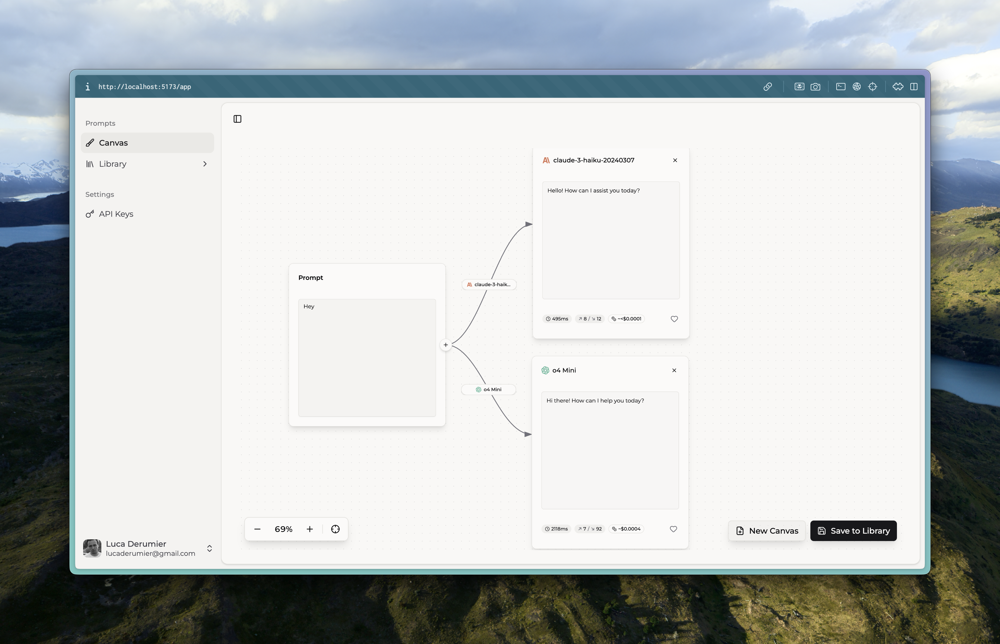

# PromptMux

> Compare LLM responses side-by-side. Send one prompt to multiple models, see all responses, rate and save them.




## Overview

PromptMux is a visual tool for comparing responses from different Large Language Models (LLMs). Enter a prompt once, send it to multiple models simultaneously, and compare the results in an intuitive canvas interface.

```
[Prompt Input] ──→ [GPT-4o]      ──→ Response + Metrics
                ├─→ [Claude 4]   ──→ Response + Metrics
                └─→ [Gemini 2.5] ──→ Response + Metrics
```

### Key Features

- **Visual Canvas** - Drag-and-drop interface for organizing prompts and responses
- **Multi-Provider Support** - OpenAI, Anthropic, Google (Gemini), and more
- **BYOK Model** - Bring Your Own API Keys (securely encrypted)
- **Library System** - Save, organize, and search your prompt comparisons
- **Response Metrics** - Track latency, token usage, and estimated costs
- **Like & Rate** - Mark favorite responses and add notes

## Tech Stack

- **Frontend**: SvelteKit 2 + Svelte 5 + Tailwind CSS v4
- **UI Components**: [shadcn-svelte](https://shadcn-svelte.com/)
- **Backend**: SvelteKit API routes
- **Database**: [Supabase](https://supabase.com/) (Auth + PostgreSQL)
- **LLM Integration**: [Vercel AI SDK](https://sdk.vercel.ai/)

## Getting Started

### Prerequisites

- Node.js 18+
- pnpm (`npm install -g pnpm`)
- A Supabase project ([create one free](https://supabase.com/))

### Installation

1. **Clone the repository**
   ```bash
   git clone https://github.com/lucaderumier/promptmux.git
   cd promptmux
   ```

2. **Install dependencies**
   ```bash
   pnpm install
   ```

3. **Set up environment variables**
   ```bash
   cp .env.example .env
   ```

   Edit `.env` with your values:
   ```env
   PUBLIC_SUPABASE_URL=your_supabase_project_url
   PUBLIC_SUPABASE_ANON_KEY=your_supabase_anon_key
   ENCRYPTION_KEY=your_64_character_hex_encryption_key
   ```

   > Generate an encryption key: `openssl rand -hex 32`

4. **Set up the database**

   Run the SQL migrations in your Supabase SQL Editor:
   - Copy contents from `supabase/migrations/` files
   - Execute in order (001, 002, etc.)

5. **Start the development server**
   ```bash
   pnpm dev
   ```

   Open [http://localhost:5173](http://localhost:5173)

### Supabase Setup

1. Create a new project at [supabase.com](https://supabase.com/)
2. Enable Email auth in Authentication > Providers
3. (Optional) Enable OAuth providers (Google, GitHub)
4. Run the database migrations
5. Copy your project URL and anon key to `.env`

## Usage

1. **Add API Keys** - Go to Settings > API Keys and add your provider keys
2. **Create Prompts** - Type your prompt in the canvas
3. **Add Models** - Click "+" to add response nodes and select models
4. **Generate** - Click "Get Response" to query the models
5. **Compare** - View responses side-by-side with metrics
6. **Save** - Save interesting comparisons to your library

## Project Structure

```
src/
├── routes/
│   ├── app/                    # Main application routes
│   │   ├── +page.svelte        # Canvas page
│   │   ├── library/            # Library page
│   │   └── api-keys/           # API keys management
│   └── api/
│       ├── llm/generate/       # LLM proxy endpoint
│       └── library/            # Library CRUD endpoints
├── lib/
│   ├── components/
│   │   ├── canvas/             # Canvas UI components
│   │   ├── sidebar/            # Navigation sidebar
│   │   └── ui/                 # shadcn-svelte components
│   ├── llm/
│   │   ├── types.ts            # Types + model configs
│   │   └── providers/          # Provider implementations
│   └── services/               # Business logic
└── hooks.server.ts             # Auth middleware
```

## Adding a New LLM Provider

1. Create `src/lib/llm/providers/{provider}.ts`:
   ```typescript
   import { createProvider } from '@ai-sdk/{provider}';
   import { generateText } from 'ai';
   import type { ProviderInstance } from './base';

   export function createMyProvider({ apiKey }): ProviderInstance {
     const provider = createProvider({ apiKey });
     return {
       provider: 'myprovider',
       generateText: async ({ model, prompt, system, maxTokens, temperature }) => {
         const result = await generateText({
           model: provider(model),
           prompt,
           system,
           maxTokens,
           temperature
         });
         return {
           text: result.text,
           usage: result.usage
         };
       }
     };
   }
   ```

2. Export from `src/lib/llm/providers/index.ts`

3. Add models to `AVAILABLE_MODELS` in `src/lib/llm/types.ts`

4. Add pricing to `MODEL_PRICING` in the same file

5. Add case in `createProvider()` in `src/routes/api/llm/generate/+server.ts`

## Scripts

```bash
pnpm dev          # Start development server
pnpm build        # Build for production
pnpm preview      # Preview production build
pnpm check        # TypeScript type checking
pnpm lint         # Run linter
pnpm format       # Format code with Prettier
```

## Contributing

We welcome contributions! Please see [CONTRIBUTING.md](CONTRIBUTING.md) for guidelines.

## Security

For security concerns, please see [SECURITY.md](SECURITY.md).

## License

This project is licensed under the MIT License - see the [LICENSE](LICENSE) file for details.

## Acknowledgments

- [shadcn-svelte](https://shadcn-svelte.com/) for the beautiful UI components
- [Vercel AI SDK](https://sdk.vercel.ai/) for the unified LLM interface
- [Supabase](https://supabase.com/) for the backend infrastructure
